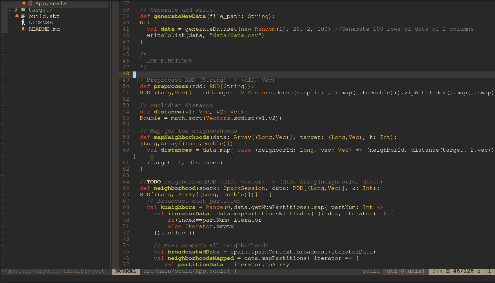

# nvim

My nvim files. I am trying to make nvim my main programming editor. All plugins I install try to make vim more IDE like and cozy.I mostly code in Scala, Python, Rust, and sometimes C.

**Language Server**

I use Coc for my language server. Install a language via :CocInstall

**Theme**: Molokai

**Plugin Manager**: VimPlug

## Plugins

| Name | Description | Plugin-Tags
|---|---|

| Coc | For autocompleltion | completion |

| vim-polgot | syntax highlighting | highlighting |

| FZF | fuzzy search | utility, search |

| i3-vim-syntax | Syntax highlighting i3wm | highlighting,i3 |

| traces | Highlights regex patterns| utility, aesthetics |

| nerdtree | File manager in vim| utility, search |

| vim-nerdtree-syntax-highlight | nerdtree highlighting| aesthetics |

| auto-pairs | autogenerates bracket pairs| utility, completion |

| goyo.vim | centers vim text | aesthetics |

| tagbar | window that shows function definitions| utility,aesthetics |

| vim-devicons | nerdtree language icons | aesthetics |

| gruvbox | A clean, easy to read theme| aesthetics, theme |

| vim airline | footerbar shows info | aesthetics |

| vim-nightfly-guicolors | for themes| aesthetics |

| vim-css-color | highlights hex values| aesthetics |

| nvim-dap-python | python debugger | debugging, utility |

| suda | sudo write to file | utility |

Recent Changes:

* Added Latex compile and preview
* Updated colorscheme
* added debugger(dap)
* added fzf support. (Ctrl-F and leader-g)
